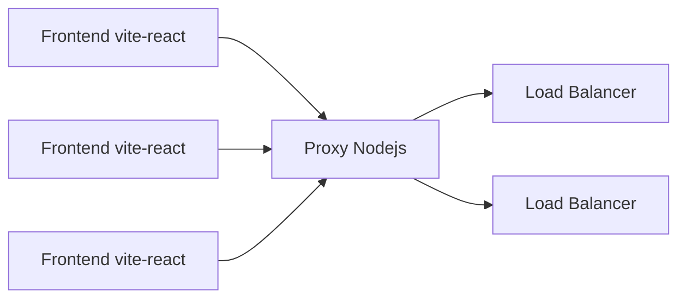

# Lupine
## Descripción

Aplicación de ChatRooms donde los usuarios se pueden registrar y crear chats con distintos usuarios, enviar mensajes, eliminar usuarios y eliminar chats.

Este repositorio se enfoca en uno de los frontend de la aplicación. Proyecto en React + Vite, aunado a un proxy montado en nodejs para lograr una conexión a los servidores.

## Arquitectura



### Tecnologías utilizadas

- **Frontend:** React + Vite, Lucide, Scss
- **Proxy:** Node.js + Express
- **Comunicación:** Sockets, (TCP, UDP)

## Para correr el proyecto

### Frontend
```bash
cd .\lupineFrontend\
npm i
npm run dev
```

### Proxy
```bash
cd .\proxy\
npm i
nodemon index.js
```

## Estructura del proyecto

```
lupineFrontend/
├── src/
│   ├── components/
│   ├── config/
│   ├── img/
│   ├── styles/
│   ├── views/
│   ├── App.jsx
│   ├── main.jsx
├── index.html

proxy/
├── chats.js
├── index.js
├── io.js
├── socketClient.js
├── users.js
```

Está construido con React + Vite y se organiza mediante el uso de Context API para la gestión del estado global y React Router Dom para la navegación entre las diferentes vistas de la aplicación.

Se utiliza React.lazy y Suspense para la carga diferida (lazy loading) de las vistas, lo que ayuda a mejorar el rendimiento inicial de la aplicación, mostrando un indicador de carga (LoadingFallback) mientras los componentes se cargan.

### Gestión de Estado Global (Context API)

La aplicación hace un uso extensivo del Context API de React para manejar el estado de la aplicación de manera centralizada y compartida entre componentes:

**AuthContext:** Gestiona el estado de autenticación del usuario (loggedIn), permitiendo saber si el usuario ha iniciado sesión y proporcionando funciones para manejar el login exitoso y el logout. Utiliza localStorage para persistir la sesión (auth token).

**LoginContext:** Provee la lógica para la validación y creación de usuarios, así como la navegación programática. Interactúa con AuthContext para actualizar el estado de loggedIn tras un inicio de sesión o registro exitoso. También maneja la obtención de información del usuario.

**ChatRoomsContext:** Maneja el estado relacionado con los salones de chat y los mensajes. Incluye funciones para obtener mensajes de chat, listar chats, añadir participantes a un chat, crear chats grupales, enviar mensajes y salir de un chat.

## Comunicación al servidor

### Desde el frontend

Se utiliza la librería de npm "axios" para llamar al proxy, si se hostean en computadoras diferentes se tiene que cambiar la constante rootEndpoint() para apuntar a la IP de la computadora que tenga el proxy.

```javascript
const server = async (endpoint, method, params = {}, body = {}) => {
    const auth = localStorage.getItem("auth");
    const res = await axios[method](`${rootEndpoint()}/${endpoint}`, { params, headers: { authorization: auth , 'Content-Type': 'application/json', 'Accept': 'application/json'}  });
     return res;
    }

exports.login = async function (req, res) {  
  const data = sendMsg(req.query, 0)
  return IO.throwResult(res, {message: "Log in", data: data})
}

exports.sendMsg = async function(params, action){
  if (action != 99){
    params.action = action
    const message = JSON.stringify(code(params))
    result = await sendTcpMessage(message)
    return JSON.parse(decode(result))
  }
  return null
}
```

exports.login = async function (req, res) {  //validate user
 const data = sendMsg(req.query, 0)
 return IO.throwResult(res, {message: "Log in", data: data})
}
exports.sendMsg = async function(params, action){
 if (action != 99){
   params.action = action
   const message = JSON.stringify(code(params))
   result = await sendTcpMessage(message)
   return JSON.parse(decode(result))
 }
 return null
}


### Dentro del proxy

Se manda a llamar cada endpoint con esta lógica, cambiar el mensaje a texto con cada acción requerida

El archivo server.js centraliza todas las llamadas al backend a través del proxy.

**Endpoints:** Un objeto que define todas las rutas disponibles en el backend (login, createUser, logout, getUserInfo, getAllUsers, createChat, addToGroupChat, sendMessage, getChats, getChatMessages, deleteFromChat, deleteChat). Cada endpoint especifica su ruta y el método HTTP (post, get, delete).

```javascript
exports.login = async function (req, res) {  //validate user
 const data = sendMsg(req.query, 0)
 return IO.throwResult(res, {message: "Log in", data: data})
}
exports.sendMsg = async function(params, action){
 if (action != 99){
   params.action = action
   const message = JSON.stringify(code(params))
   result = await sendTcpMessage(message)
   return JSON.parse(decode(result))
 }
 return null
}
```

### Comunicación TCP/UDP

Como parte del proxy, el archivo socketClient.js es fundamental para la comunicación de bajo nivel con los balanceadores de carga y servidores backend, utilizando los protocolos TCP y UDP.

**Balancers:** Un array de objetos que configura las direcciones IP y puertos (TCP y UDP) de los balanceadores de carga. Esto permite que el proxy intente comunicarse con múltiples balanceadores para asegurar la disponibilidad.

**sendTcpMessage:** Función que intenta enviar un mensaje a través de TCP a los balanceadores configurados. Implementa un reintento secuencial si un balanceador falla y maneja timeouts.

**sendUdpMessage:** Función similar para el envío de mensajes a través de UDP, con lógica de reintento y manejo de timeouts.

**Manejo de Errores y Timeouts:** Ambas funciones (trySendTcp, trySendUdp) incluyen lógica para manejar errores de conexión y timeouts (3 segundos), lo que asegura la resiliencia de la comunicación.

## Protocolo de comunicación (JSON)

- Toda la comunicación entre cliente y servidor está basada en el formato JSON.
- Se exige el campo "action" como entero, que representa el tipo de operación solicitada (ej. PING, CREATE_USER, SEND_MESSAGE).
- Si el JSON está mal formado o falta un campo esencial, se responde con un mensaje de error también en formato JSON.


## Integrantes del equipo

Nombres en github:
- Santiago Arreola Mungia - **sarreolam**
- Marco Antonio Manjarrez Fernandez - **MarcoManjarrez**
- Luis Felipe Organista Méndez - **Organistaf**
